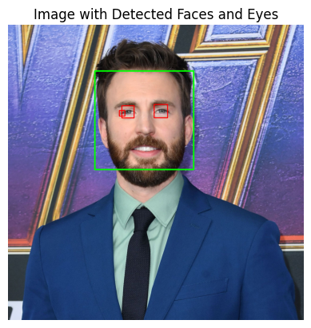

# Face and Eye Detection

## Overview
This project focuses on detecting faces and eyes in images using OpenCV and Haar cascades. It includes functions to detect faces, eyes, and both in an image.

## Prerequisites
- Python 
- OpenCV
- Matplotlib

## Example

1. **Original**

   
   

2. **Face Detection**

   
   

3. **Eyes Detection**

   
   

4. **Face and Eyes Detection**

   
   

## Maintainer
**ARUN KUMAR REDDY VEMULA**
AI/ML Engineer
Email: arunkumarreddy952@gmail.com

I am an AI/ML Engineer with over 5 years of experience building practical machine learning solutions for autonomous vehicles, fraud detection, and industrial IoT. My work involves deploying real-time computer vision models on edge devices and optimizing model performance through quantization and distributed computing. I am passionate about turning complex business problems into functional AI systems and maintaining scalable machine learning workflows.